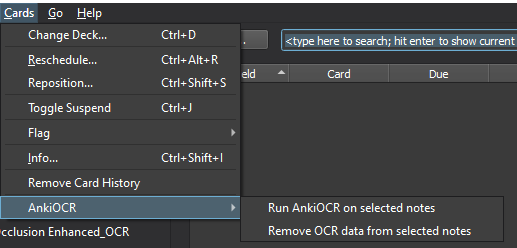
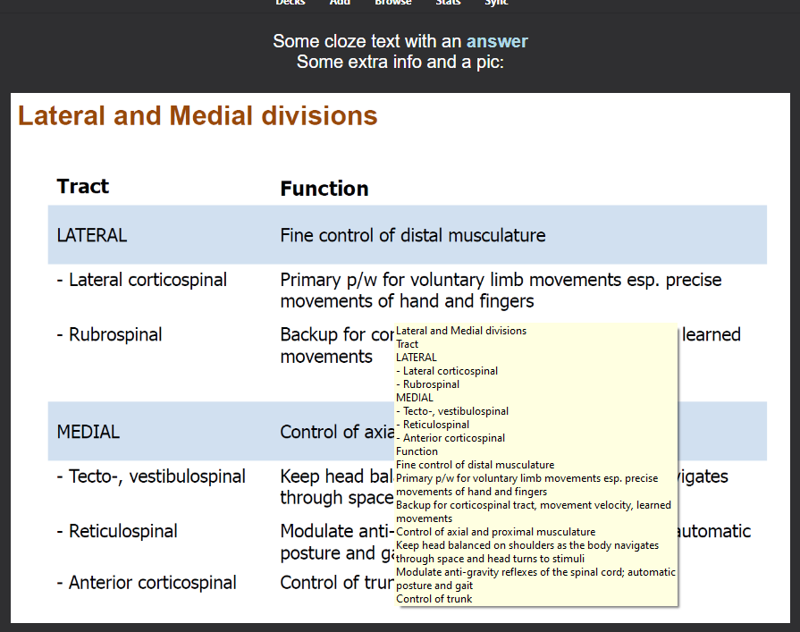

# AnkiOCR

Anki 2.1 addon to generate OCR text from images inside of Anki notes/cards. Note that this is only designed for computer generated text, not handwritten.

The aim of this addon was to generate searchable text for image-heavy notes, it is not intended to produce high quality, perfectly ordered text!

Note that because this addon changes the note template, you will see a warning about changing the database and uploading to AnkiWeb. This is normal.

## Usage

1. Open the card browser and select the note(s) you want to process. Use the search bar at the top, select tags, decks, etc.

2. On the toolbar at the top, select 'Cards', then 'AnkiOCR', and select 'Run AnkiOCR on selected notes', as shown below

 

3. After processing, each of the images in the note will have the ocr data embedded in the `title` html tag, viewable as a tooltip:

 

4. If you want to remove the OCR data from any notes, select them and then use the "Remove OCR data from selected notes" option in the menu shown above

If you wish to have the OCR data outputted to the 'OCR' field on the note, you can set the `text_output_location` config option to `ocr_field`

If you want to add new languages, you need to download the [appropriate language data from here](https://github.com/tesseract-ocr/tessdata).

## Installation

AnkiOCR depends on [the Tesseract OCR library](https://github.com/tesseract-ocr/tesseract).

If you're on **Windows** or **Mac**, tesseract is bundled with the addon.

If you're on **Linux** [carefully follow the instructions here](https://tesseract-ocr.github.io/tessdoc/Home.html)

AnkiOCR was built on Python 3.8, but should work for Python versions >= 3.7.

It is highly recommended to to use inside the Anki application, by [installing the addon from AnkiWeb](https://ankiweb.net/shared/info/450181164)
If you want to run it externally to anki, see below:

Then clone the git repo:

`git clone https://github.com/cfculhane/AnkiOCR`

Create a venv, then once activated install requirements:

`pip install -r requirements.txt`

## Testing

Ensure all requirements as above are install, then run `pytest`
